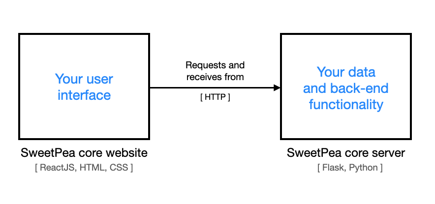

# Create web applications with SweetPea
SweetPea is a tiny web development kit. It provides a basic client-server framework that any developer can use to create dynamic web applications. It includes:

* A core website for your user interface
* A core server for your back-end functionality


All you need to do is:
1. Build your user interface on top of the core website.
    * [ReactJS](https://reactjs.org), [HTML](https://www.w3schools.com/html/), and [CSS](https://www.w3schools.com/css/)


2. Program your API and back-end functionality on top of the core server.
    * [Flask](https://flask.palletsprojects.com/en/2.2.x/) and [Python](https://www.python.org/)


Figure 1 shows an overview of the SweetPea architecture.

<p align="center">
  
</p>
<p align="center">Figure 1. SweetPea architecture overview.</p>

SweetPea is intended for prototyping, learning, and having fun with web applications. SweetPea is yet to become a website builder, hosting service, or production environment.

## Release Notes
<!-- Semantic versioning: https://semver.org/-->
<!-- Major change x.0.0
     Minor change 0.x.0
     Bug fix      0.0.x -->

<!-- https://simonwillison.net/2022/Jan/31/release-notes/ -->
<!-- https://www.productplan.com/learn/release-notes-best-practices/ -->

* **Version**: 1.0.0
* **Date**: Jan 5, 2023
* **Features**:
  * Core website:
    * Ready-to-develop front end _(React 18.2.0)_
      * Blank React web app _(bootstrapped with [Create React App](https://github.com/facebook/create-react-app))_
      * Demo UI element
  * Core server: 
    * Ready-to-develop back end _(Flask 2.2.2)_
      * Functional server for API and backend functionality
      * Demo endpoint

[See all release notes.](docs/releases.md)

## Table of Contents

* [Get started with SweetPea](#Get-started-with-SweetPea)
    * [Install the requirements](#install-requirements)
    * [Launch the SweetPea core website](#launch-core-website)
    * [Start the SweetPea core server](#start-core-server)
    * [Test website and server communication](#communication)
* [Demo walkthrough](#Demo-walkthrough)
* [Next steps for you](#Next-steps-for-you)
* [License](#License)
<!-- * [Development resources](#Development-resources)-->

## Get started with SweetPea
> ⚠️ These instructions were tested on a laptop running macOS Monterey 12.6 with an M1 chip.

In a terminal, navigate to the directory where you plan to install SweetPea and clone the [repository](https://github.com/eleblanc-ai/sweetpea).

    git clone https://github.com/eleblanc-ai/SweetPea.git

<a name="install-requirements">

### 1. Install the requirements
There are a few ways to install the project requirements. I used [Homebrew](https://brew.sh/), [NPM](https://docs.npmjs.com/), and [pip](https://pip.pypa.io/en/stable/).

To follow the instructions below, [install Homebrew ahead of time](https://brew.sh/). NPM and pip are installed automatically with NodeJS and Python3, respectively.

Install the requirements in the SweetPea project directory.

    cd SweetPea


#### Requirements:

1. [NodeJS](https://nodejs.org/) -- *a cross-platform Javascript run-time environment for browsers.*

       brew install node

<!--$ node -v
v18.9.0-->
2. [ReactJS](https://reactjs.org) -- *a JavaScript library for building user interfaces.*

       npm install react

<!--$ npm view react version
18.2.0-->
3. [Python](https://www.python.org/) -- *a language for developing the website's back-end functionality.*

       brew install python3

<!-- $ python3 --version
Python 3.10.6 -->
4. [Flask](https://flask.palletsprojects.com/en/2.2.x/) -- *a web app framework for mapping HTTP requests from the website to Python functions.*

       pip3 install Flask

<!-- $ flask --version

Python 3.10.6
Flask 2.2.2
Werkzeug 2.2.2 -->

Once you've installed the requirements, you can launch SweetPea's core website.

<a name="launch-core-website">

### 2. Launch the SweetPea core website
1. Install the core website's package modules from the `SweetPea/core-website` directory.

       npm install

> ⚠️ At this step, `npm audit` (which is run automatically as part of `npm install`) is [likely to report security vulnerabilities in dependency packages](https://overreacted.io/npm-audit-broken-by-design/). You can choose to [ignore the audit report](https://www.voitanos.io/blog/don-t-be-alarmed-by-vulnerabilities-after-running-npm-install/#how-should-you-handle-these-audit-reports). Otherwise, check out NPM's documentation on [auditing dependency packages for security vulnerabilities](https://docs.npmjs.com/auditing-package-dependencies-for-security-vulnerabilities).


<!-- If you choose instead to dig into any warnings that come up, then I recommend first checking out NPM's documentation on [auditing packages for security vulnerabilities](https://docs.npmjs.com/auditing-package-dependencies-for-security-vulnerabilities).--> 

2. Build and start the core website.

        npm run build
        npm start

The output of `npm start` should look similar to this:
```
Compiled successfully!

You can now view frontend in the browser.

  Local:            http://localhost:3000
  On Your Network:  http://xxx.xxx.xxx.xxx:3000

Note that the development build is not optimized.
To create a production build, use npm run build.

webpack compiled successfully

```
NPM should automatically open SweetPea's core website, shown in Figure 1 below. Otherwise, you can navigate to http://localhost:3000 to visit the website in your browser, as shown in Figure 2.
<p align="center">
  
</p>
<p align="center">Figure 2. Launching the SweetPea core website.</p>

You can optionally [change the hostname and port for the core website](https://dev.to/kevinmel2000/nodejs-reactjs-change-host-and-port-number-70b).


Once the core website is up and running, you can start the SweetPea core server.

<a name="start-core-server">

### 3. Start the SweetPea core server
The server is a [basic Flask app](https://flask.palletsprojects.com/en/1.1.x/quickstart/#a-minimal-application) that includes one test endpoint called `testMessage`.

1. Start the core server from the `SweetPea/core-server` directory in a new terminal tab or window.

       python3 Server.py

The output should look similar to the following:
```
 * Serving Flask app 'app'
 * Debug mode: on
WARNING: This is a development server. Do not use it in a production deployment. Use a production WSGI server instead.
 * Running on http://localhost:5000
Press CTRL+C to quit
 * Restarting with stat
 * Debugger is active!
 * Debugger PIN: 285-622-087
```
You can check that the server's demo API endpoint is available by visiting http://localhost:5000/testMessage in a browser, as shown in Figure 3.

<p align="center">
<br/>
  
</p>
<p align="center">Figure 3. Testing the SweetPea core server's demo endpoint.</p>

The server optionally accepts arguments for hostname, port, threaded mode, and debug mode as follows:
```
usage: Server.py [-h] [-n HOSTNAME] [-p PORT] [-t] [-d]

options:
  -h, --help            show this help message and exit
  -n HOSTNAME, --hostname HOSTNAME
                        set a hostname
  -p PORT, --port PORT  set a port for listening
  -t, --threaded        enable threaded mode
  -d, --debug           enable debug mode
```

> ⚠️ If you change the server's hostname or port, you will also need to tell the website how to reach the core server. To do so, update the following constants in `core-website/src/consts.js` to reflect your changes:
>* `SERVER_HOSTNAME`
>* `SERVER_PORT`
>
>
<!-- 
Later: 
"proxy":"http://localhost:5000" in package.json

https://create-react-app.dev/docs/proxying-api-requests-in-development/

You will also need to update the value of `proxy` in `core-website/package-json` to reflect the new port and hostname. --> 

You can set [additional arguments](https://flask.palletsprojects.com/en/2.2.x/api/#flask.Flask.run) for your Flask app by editing the `app.run` call in `Server.py`.

<a name="communication">

### 4. Test website and server communication

Now that the website and server are both online, you can verify that the two can talk to each other.
SweetPea's core website comes with a small demo that lets you test for communication between the website and server.

1. In the SweetPea core website, press the button to make a request to the server for a test message. If the request is successful, the response appears below the button, as shown in Figure 4.

<p align="center">
  
</p>
<p align="center">Figure 4. Testing for communication between the core website and server.</p>


# Next steps for you
* To learn more about how the website and server communicate in the demo, check out the [Demo walkthrough](docs/demo-walkthrough.md)

* If you want to start digging around the code, check out these starting points for the website and server:

    * Website:
        * `SweetPea/core-website/src/App.js`
    * Server:
        * `SweetPea/core-server/Server.py`


* Check out a tutorial:
  * [Adding back-end functionality to the core server](docs/back-end-functionality.md)


* [Learn how to build a user interface with React](https://reactjs.org/tutorial/tutorial.html).


* [Learn how to develop a Flask server](https://flask.palletsprojects.com/en/2.2.x/quickstart/#a-minimal-application).


* Stay tuned for more documentation, tutorials, and new features.

<!-- * If you want to see more examples of how to work with SweetPea, check out the [Tutorials](#Tutorials) page.


* If you want to learn more about what's going on under the hood, head over to [System documentation](TBD). -->


<!--
# Example walkthrough

Otherwise, check out the [Example walkthrough](#Example-walkthrough) to learn how the core website and server communicated in this example.

# Development resources
## Tutorials
## Examples
## Documentation
## External resources -->

# License
MIT License

Copyright (c) 2022 Emily LeBlanc

Permission is hereby granted, free of charge, to any person obtaining a copy
of this software and associated documentation files (the "Software"), to deal
in the Software without restriction, including without limitation the rights
to use, copy, modify, merge, publish, distribute, sublicense, and/or sell
copies of the Software, and to permit persons to whom the Software is
furnished to do so, subject to the following conditions:

The above copyright notice and this permission notice shall be included in all
copies or substantial portions of the Software.

THE SOFTWARE IS PROVIDED "AS IS", WITHOUT WARRANTY OF ANY KIND, EXPRESS OR
IMPLIED, INCLUDING BUT NOT LIMITED TO THE WARRANTIES OF MERCHANTABILITY,
FITNESS FOR A PARTICULAR PURPOSE AND NONINFRINGEMENT. IN NO EVENT SHALL THE
AUTHORS OR COPYRIGHT HOLDERS BE LIABLE FOR ANY CLAIM, DAMAGES OR OTHER
LIABILITY, WHETHER IN AN ACTION OF CONTRACT, TORT OR OTHERWISE, ARISING FROM,
OUT OF OR IN CONNECTION WITH THE SOFTWARE OR THE USE OR OTHER DEALINGS IN THE
SOFTWARE.

---
<p align="center">
  

</p>

