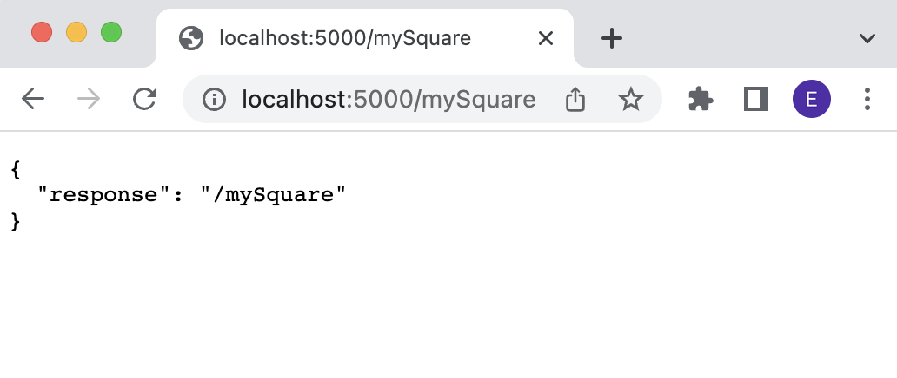

# Adding back-end functionality

Write any Python function you want. For example, the following function `mySquareFunction()` returns the square of the argument `x` if it is a numeric type.

       def mySquareFunction(x):

           try:
               return x*x
           except:
               return "Invalid argument, expected a numeric type."

Add your new function to the core server by importing it or adding it directly into `core-server/Server.py`. Make the new function accessible via HTTP using the following steps.

## Create a new endpoint
1. In `core-server/Server.py`, add a new [route decorator](https://flask.palletsprojects.com/en/2.2.x/api/#flask.Flask.route) named after your function. In this example, the endpoint `/mySquare` is configured to respond to `GET` requests:

       @app.route("/mySquare", methods = ['GET'])

2. Under the route decorator, define a [view function](https://flask.palletsprojects.com/en/2.2.x/tutorial/views/#:~:text=A%20view%20function%20is%20the,turns%20into%20an%20outgoing%20response.) named after your function that returns a JSON object. We'll build out this function to handle responses for the `/mySquare` route.

       @app.route("/mySquare", methods = ['GET'])
       def mySquare():
           return jsonify({'response':'/mySquare'})

3. At this point in the example, the `/mySquare` has been mapped to the `mySquare()` function in the core server.

You can test that the route is available by starting the core server (e.g., `python3 Server.py`) and visiting http://localhost:5000/mySquare in a browser window, as shown in Figure 1.

  

Figure 1. Testing the <tt>/mySquare</tt> endpoint.  

## Handle HTTP requests to the endpoint

1. In the view function, save the request arguments in a dictionary called `args`. Then save the value of `x` in args to a local variable.

       @app.route("/mySquare", methods = ['GET'])
       def mySquare():
           args = dict(request.args.items())
           x = args['x']

2. Call your imported function using the parsed arguments.

       @app.route("/mySquare", methods = ['GET'])
       def mySquare():
           args = dict(request.args.items())
           x = int(args['x'])

           square = mySquareFunction(x)

3. Respond to the request with the return value of your function.

       @app.route("/mySquare", methods = ['GET'])
       def mySquare():
           args = dict(request.args.items())
           x = int(args['x'])

           square = mySquareFunction(x)

           return jsonify({'response':square})

You can test that the `/mySquare` route is working using a test value `x=2` by visiting http://localhost:5000/mySquare?x=2 in the browser (see Figure 2).

  

Figure 1. Testing the <tt>/mySquare</tt> endpoint with argument <tt>x=2</tt>.  

## Next
* Create new functionality and endpoints, for example:
   * Query a database
   * Serve a file
* Stay tuned for a tutorial on accessing an endpoint from the core website.
