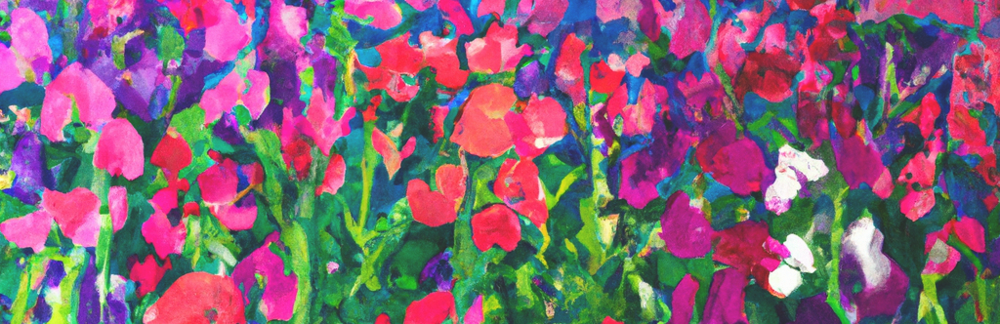

# Release notes
This page contains all release notes for SweetPea.
<!-- Semantic versioning: https://semver.org/-->
<!-- Major change x.0.0
     Minor change 0.x.0
     Bug fix      0.0.x -->

<!-- https://simonwillison.net/2022/Jan/31/release-notes/ -->
<!-- https://www.productplan.com/learn/release-notes-best-practices/ -->

# SweetPea 2.0.0
* **Date**: Jan 12, 2023
* **Changes**:
    * Created new Glossary
    * Refactored "Core Website" and "Core Server" to "Website" and "Server"
      * Incompatible with previous v1.0.1
    * Updated documentation in compliance with new Glossary
    * Moved `resources` directory to `server` directory.
    * Moved documentation figures from `resources` to `docs` directory.
  
* **Features**:
    * Website:
        * Ready-to-develop front end _(React 18.2.0)_
            * React/JS web app for user interface
            * Demo UI element
    * Server:
        * Ready-to-develop back end _(Flask 2.2.2)_
            * Demo server for API and software resources
            * Demo API and resource
---

# SweetPea v1.0.1
* **Date**: Jan 6, 2023
* **Features**:
    * Core website:
        * Ready-to-develop front end _(React 18.2.0)_
            * Blank React web app _(bootstrapped with [Create React App](https://github.com/facebook/create-react-app))_
            * Demo UI element
    * Core server:
        * Ready-to-develop back end _(Flask 2.2.2)_
            * Functional server for API and backend functionality
            * Demo endpoint
* **Bug fix**:
  * `core-website/package.json`: changed `npm start` port from (incorrect) 4242 back to default 3000.
---

# SweetPea v1.0.0
* **Date**: Jan 5, 2023
* **Features**:
    * Core website:
        * Ready-to-develop front end _(React 18.2.0)_
            * Blank React web app _(bootstrapped with [Create React App](https://github.com/facebook/create-react-app))_
            * Demo UI element
    * Core server:
        * Ready-to-develop back end _(Flask 2.2.2)_
            * Functional server for API and backend functionality
            * Demo endpoint
---

  

